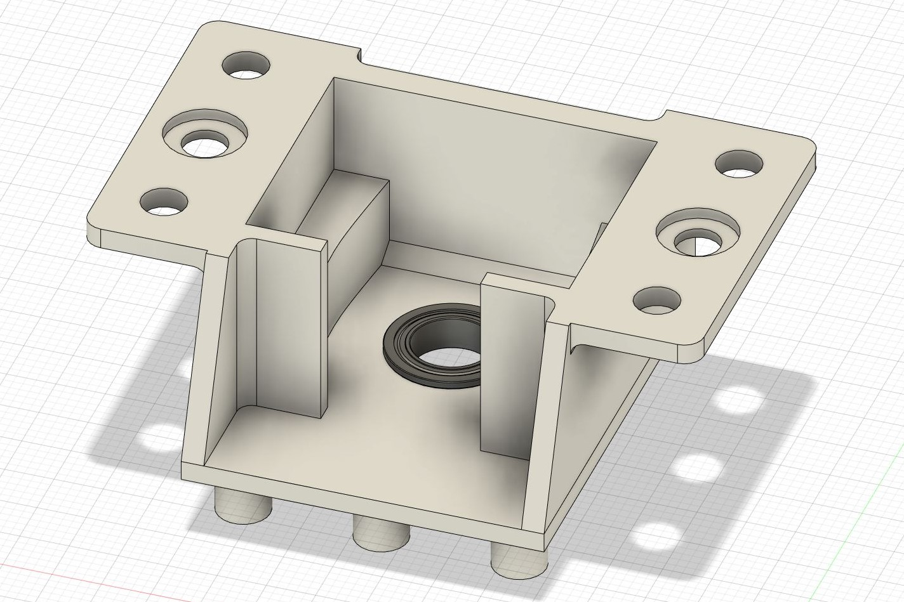
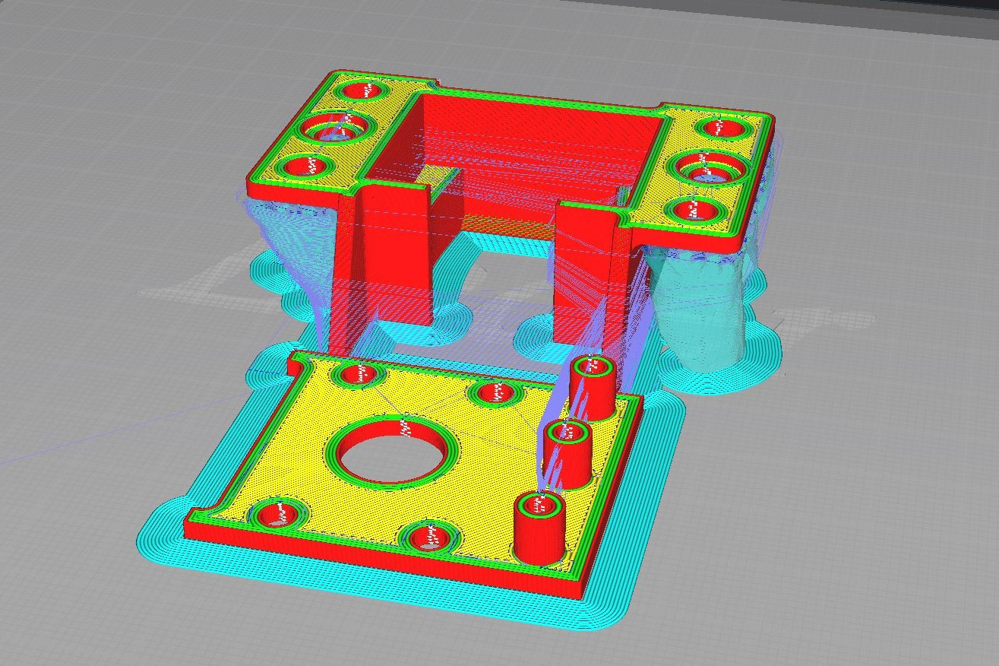
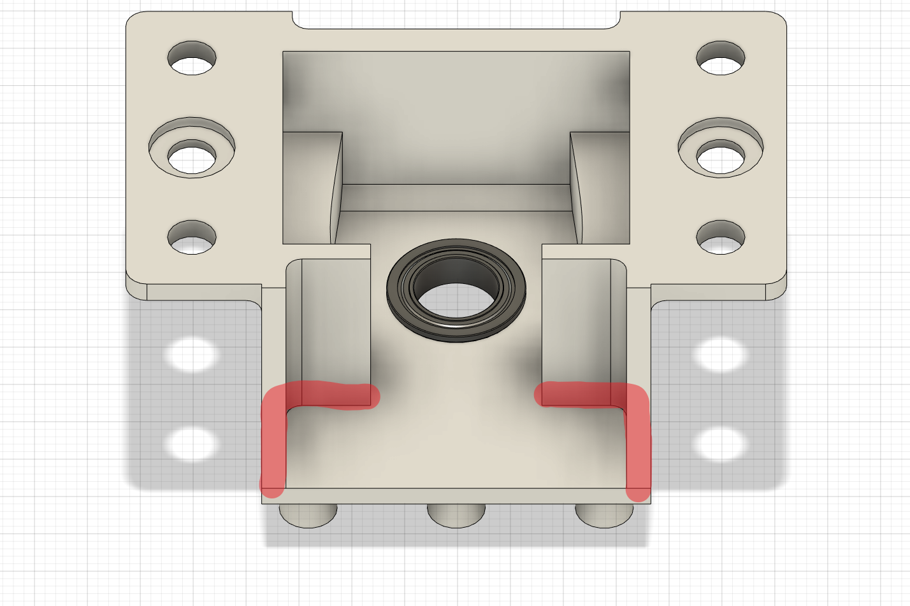

# F2 Knob Housing
Part replacement for GAMO2's FAUCETWO lower knob bracket

## Parts required
| Part                                                                      | Qty |
|---------------------------------------------------------------------------|-----|
| M3x10 screws                                                              | 4   |
| MF128ZZ flange ball bearing (can be salvaged from your old lower bracket) | 1   |
| super glue or epoxy glue (optional)                                       | 1   |

## Instructions
Print the Housing Top and Housing Bottom with 0.2mm layer height, 20% infill, x2 infill line multiplier and tree support. You can also go ham with 100% infill if you want      
Full 1 part .stl is also included if you can figure out how to print it

After printing all the parts, insert the flange bearing and thread the 4 screws directly to the bottom     
I also highly recommend gluing the highlighted area to prevent sensor from drooping down

## Thing to note
I'd still keep the old broken parts as they still work fine, just with a little wiggle